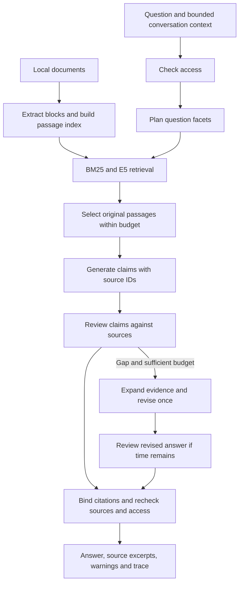

# SISU Onboarding Assistant

A local assistant for asking questions about your documents, finding organizational responsibilities, and locating relevant video metadata. This repository packages the **V10 document assistant**: hybrid keyword/semantic retrieval, questions decomposed into requested facts, answers grounded in original passages, and a bounded source review and revision stage.

The default language model is **`gpt-oss:20b` through Ollama**. Retrieval uses the pinned **`intfloat/multilingual-e5-small`** encoder on the CPU. After installing dependencies and downloading the models, ordinary document indexing and answering use local files and local services. No OpenAI API key or GitHub authentication is required to run the assistant.

This is an application built around existing pretrained models. It does not train its own foundation model, update neural weights during conversations, or run the older experimental recursive-learning controllers.

To publish this prepared copy yourself, use the [Git upload commands](PUBLISHING.md). Running the application does not require publishing it.

## Contents

- [How it works](#how-it-works)
- [Setup](#setup)
- [Features and commands](#features-and-commands)
- [Configuration](#configuration)
- [Mathematics and algorithms](#mathematics-and-algorithms)
- [Project layout and saved data](#project-layout-and-saved-data)
- [Tests](#tests)
- [Limitations and troubleshooting](#limitations-and-troubleshooting)

## How it works

1. **Index:** extract documents into sections and source blocks with locators, hashes, and extraction warnings. Split blocks into overlapping passages and cache their embeddings.
2. **Authorize:** determine which documents this local user can search, read, and cite. Restrict both retrieval lanes to that set.
3. **Plan:** turn the question into up to six requested facts or conditions, called *facets*. If planning fails, use the original question.
4. **Retrieve:** search by both words and meaning, merge rankings, select evidence across the facets, and include neighboring context. Present table and section passages in source order.
5. **Draft:** ask the model for factual claims and supporting passage IDs. Application code attaches the actual passage text; the model does not invent the quotation text.
6. **Review:** ask the model to check support and missing question parts against the passages. If time permits, retrieve additional evidence and perform one revision and another review. Preserve previously unflagged content unless the revision satisfies the retention checks.
7. **Release:** recheck source identity and access, attach clickable citations, and report missing information or incomplete checks.



Exact citation binding establishes **provenance**, not the truth of the model's interpretation. A model can still misread a correctly quoted table or compare the wrong entities. Review findings are also fallible.

## Setup

### Requirements

- Python **3.11** is the recommended starting point; use a 64-bit installation.
- [Ollama](https://ollama.com/) installed and running locally.
- Enough disk space for Python dependencies, the embedding model, the Ollama model, and your document workspace. The pinned encoder download is approximately 0.5 GB; the generator is much larger.
- A GPU supported by Ollama is useful for interactive speed. CPU generation is possible but can exceed the default deadline. GPU requirements depend on the model quantization and context size; this repository does not promise a universal minimum.

The Python embedding encoder runs on the CPU even if Ollama uses a GPU. A CUDA-enabled Python installation is not required for the main assistant.

### Windows / PowerShell

Open PowerShell in the repository directory. The following commands use the virtual environment explicitly, so activating scripts or changing PowerShell execution policy is unnecessary:

```powershell
py -3.11 -m venv .venv
.\.venv\Scripts\python.exe -m pip install --upgrade pip
.\.venv\Scripts\python.exe -m pip install torch==2.11.0 --index-url https://download.pytorch.org/whl/cpu
.\.venv\Scripts\python.exe -m pip install -r requirements.txt
.\.venv\Scripts\python.exe scripts/download_encoder.py
ollama pull gpt-oss:20b
.\.venv\Scripts\python.exe run_assistant.py index examples/documents
.\.venv\Scripts\python.exe run_assistant.py doctor
.\.venv\Scripts\python.exe run_assistant.py ui
```

If the Ollama desktop service is not already running, run `ollama serve` in a separate terminal before `doctor` or `ui`. The browser opens at **http://127.0.0.1:8782**. Wait until the application reports that the engine is ready before submitting a question.

The Windows wrapper selects this repository's `.venv` automatically:

```powershell
.\assistant.cmd ask "What does the example onboarding guide say?"
.\assistant.cmd chat
.\assistant.cmd ui
```

### Linux / macOS

Install Python 3.11 and Ollama for your platform, then run:

```bash
python3.11 -m venv .venv
.venv/bin/python -m pip install --upgrade pip
.venv/bin/python -m pip install torch==2.11.0 --index-url https://download.pytorch.org/whl/cpu
.venv/bin/python -m pip install -r requirements.txt
.venv/bin/python scripts/download_encoder.py
ollama pull gpt-oss:20b
.venv/bin/python run_assistant.py index examples/documents
.venv/bin/python run_assistant.py doctor
.venv/bin/python run_assistant.py ui
```

The shell wrapper can be invoked using `sh assistant ...`, or run `chmod +x assistant` once and then `./assistant ...`. Windows OCR is unavailable on these platforms. The core application is portable; this snapshot's principal end-to-end validation was performed on Windows.

On macOS, install the standard PyPI PyTorch wheel with `.venv/bin/python -m pip install torch==2.11.0` instead of the CPU-index command if that index has no wheel for your platform. These are pinned reproducibility dependencies; package-wheel availability was not rechecked for every operating system while preparing this export.

### Use your own documents

In the commands below, `python` means the interpreter inside the environment created above. On Windows, replace it with `.\.venv\Scripts\python.exe`; on Linux/macOS use `.venv/bin/python`, or activate the environment first.

```text
python run_assistant.py index "C:\path\to\documents"
python run_assistant.py ask "Which conditions must be met before deployment?"
python run_assistant.py ui
```

`index` **rebuilds/replaces the document collection** in the selected workspace from all the paths supplied to that command. It is not an append command. Include every folder/file you want retained:

```text
python run_assistant.py index "C:\docs\handbooks" "C:\docs\procedures" "C:\docs\reference.pdf"
```

Keep the original files available: citations retain their locations, and release checks detect files changed since indexing. Re-index after changing or moving files. Stop and restart a running UI after rebuilding its workspace so it loads the new collection.

The supported extensions are **`.pdf`, `.docx`, `.txt`, `.md`, `.html`, and `.htm`**. Folders are searched recursively. HTML input is a local file; indexing a URL does not crawl a website.

### Offline encoder installation

On a machine where the pinned encoder files are already available:

```text
python scripts/download_encoder.py --source "C:\models\multilingual-e5-small"
```

The installer copies and verifies the files against `model_manifests/multilingual-e5-small.json`. A different encoder revision cannot be substituted just by renaming its directory. Ollama model installation is separate. Missing encoder files produce a visible keyword-only fallback; hash mismatches are integrity errors.

## Features and commands

**Global options come before the command:** `python run_assistant.py --workspace PATH --model MODEL --user USER_ID ask "..."`. Run `python run_assistant.py --help` or append `--help` to a subcommand for its full argument reference. With no arguments, the repository runner starts the UI.

### Document and conversation features

| Feature | How to use it |
|---|---|
| PDF, DOCX, text, Markdown and local HTML extraction | `python run_assistant.py index PATH [PATH ...]` |
| Persistent index and reusable embeddings | Built during `index`; reused when the workspace is loaded |
| Separate document libraries | `python run_assistant.py --workspace workspace-team index PATH` and use the same option for later commands |
| One-shot answers with sources | `python run_assistant.py ask "QUESTION"` |
| Interactive terminal conversation | `python run_assistant.py chat` |
| Browser chat and clickable citation excerpts | `python run_assistant.py ui` |
| Start server without opening a browser | `python run_assistant.py ui --no-browser` |
| Progress, elapsed time, queue position and warnings | Shown by the interfaces while answering; browser provides the fuller progress view |
| Follow-up questions | Ask a follow-up in the same browser/terminal conversation |
| Reset conversation | Browser **New conversation** or terminal `/new` |
| Last answer's source list | Terminal `/sources`; click citations in the browser |
| Runtime status | `python run_assistant.py doctor` or terminal `/status` |
| Coverage, timings and debugging | `python run_assistant.py ask "QUESTION" --debug` or `chat --debug` |
| Leave terminal chat | `/quit`, `/exit`, `/q`, or end of input |

The following features run automatically during a document answer; they are not separate commands:

- Keyword plus multilingual semantic retrieval, fused across question facets.
- Cross-document evidence selection with a mild preference for source diversity.
- Neighboring context and table/section ordering to retain conditions and qualifiers.
- Compact prompt metadata while retaining full source identities internally.
- Claims bound to immutable selected passages and code-generated citation labels.
- Source review, focused evidence expansion, and bounded revision when budget remains.
- Partial answers, missing-facet reporting, extraction warnings and scoped abstention.
- Rejection of malformed claim records, stale audits and revisions that silently drop required prior content.
- File-hash, corpus-generation, and authorization checks before releasing an answer.
- Context, output-token, model-call and deadline limits; inference locking and browser queuing.
- Conversation hints limited to prior questions and actually cited identifiers. Prior generated prose is not used as new source evidence.

Multilingual **retrieval** is supported by the encoder. This does not establish equal answer quality in every language. Question planning, generation and review depend on the selected language model.

### People directory

Run administration commands as the default local administrator. Example records are fictional:

```text
python run_assistant.py person add "Alex Example" --id alex --alias "A. Example" --organization "Example Team" --email "alex@example.com"
python run_assistant.py person list
python run_assistant.py person list "Alex"
python run_assistant.py person update alex --organization "Platform Team"
python run_assistant.py person list --history
python run_assistant.py person deactivate alex
```

`add` and `update` accept `--classification public|internal|confidential|restricted`. Repeat `--alias` for multiple aliases. Supplying aliases to `update` replaces the alias set. Deactivation retains historical records. Run the deactivation example only after you have finished using the example person in the next section.

### Organizational roles and responsibilities

Organizational roles describe work responsibilities; they are separate from the system roles used for permissions.

```text
python run_assistant.py role add alex "Onboarding owner" --id onboarding-owner --organization "Example Team" --scope "New starters" --responsibility "Maintain the onboarding guide" --valid-from 2026-01-01 --provenance manual --note "Example assignment"
python run_assistant.py role list "onboarding"
python run_assistant.py role list --as-of 2026-06-01
python run_assistant.py ask "Who is responsible for onboarding?"
python run_assistant.py role update onboarding-owner --new-id onboarding-owner-v2 --responsibility "Maintain the guide and run orientation"
python run_assistant.py role list --history
python run_assistant.py role end onboarding-owner-v2 --at 2026-12-31
python run_assistant.py role deactivate onboarding-owner-v2
```

Updates create successor records so earlier assignments remain inspectable. `end` records a validity endpoint; `deactivate` retracts a record. Role creation also supports:

| Option | Meaning |
|---|---|
| `--target-person PERSON_ID` | Scope a responsibility to another registered person |
| `--valid-until DATE` | Exclusive validity endpoint |
| `--status asserted` / `--status disputed` | Keep a disputed assertion visible as such |
| `--classification LEVEL` | Resource classification metadata |
| `--provenance manual` / `document` / `imported` | Declared provenance kind |
| `--source-document REVISION_ID --source-block BLOCK_ID` | Bind document provenance to indexed identifiers |
| `--note TEXT` | Provenance explanation |

For document provenance, use actual identifiers from the index/diagnostic trace, not a filename. `role list` also accepts `--limit N`. Historical searches and competing role records are available; an assignment's existence is not proof that a disputed responsibility is settled.

### Video metadata and chapters

The assistant stores supplied metadata, searches titles/descriptions/tags/speakers/chapters, and exposes permitted links with timestamps. It does **not** download, watch, transcribe or summarize video content on its own.

Save a metadata file such as `video-example.json`:

```json
{
  "video_id": "orientation-demo",
  "title": "Example orientation",
  "url": "https://example.com/orientation",
  "description": "An example entry; replace its URL with your actual video.",
  "speaker": "Alex Example",
  "date": "2026-01-15",
  "duration_seconds": 600,
  "tags": ["onboarding", "orientation"],
  "project": "Example Team",
  "classification": "internal",
  "chapters": [
    {"chapter_id": "orientation-access", "title": "Getting access", "start_seconds": 0, "end_seconds": 180, "keywords": ["accounts", "access"]},
    {"chapter_id": "orientation-docs", "title": "Finding documentation", "start_seconds": 180, "end_seconds": 600}
  ]
}
```

```text
python run_assistant.py video import video-example.json
python run_assistant.py video list "access"
python run_assistant.py video list --limit 20
python run_assistant.py ask "Find an onboarding video about access"
python run_assistant.py video deactivate orientation-demo
```

Use `path` instead of `url` for a supplied local path. Chapters must be ordered and within the stated duration. Importing metadata does not fetch the locator. Link visibility requires the additional `video.open` permission.

### Local users, groups and permissions

This application has **local authorization**, not a remote identity provider or login service. `--user` selects a trusted local principal for that process; it is not password authentication. The loopback UI runs under its configured principal. OS access to the workspace and the machine remains part of the trust boundary.

Create a user and a group:

```text
python run_assistant.py access user-add alex-user "Alex Example" --system-role researcher
python run_assistant.py access user-show alex-user
python run_assistant.py access group-add onboarding-team "Onboarding team"
python run_assistant.py access member-add onboarding-team alex-user --valid-until 2027-01-01
python run_assistant.py access role-assign onboarding-team researcher --principal-type group
python run_assistant.py access resource-list --type document --limit 50
```

A system role supplies action capabilities; resource grants determine which records those actions can reach. Creating a `researcher` does not by itself grant access to all documents. Replace `DOCUMENT_ID` with the resource ID printed by `resource-list`:

```text
python run_assistant.py access grant onboarding-team document DOCUMENT_ID document.search --principal-type group
python run_assistant.py access grant onboarding-team document DOCUMENT_ID document.read --principal-type group
python run_assistant.py access grant onboarding-team document DOCUMENT_ID document.cite --principal-type group
python run_assistant.py --user alex-user ask "What does the permitted document say?"
```

Additional administration examples:

```text
python run_assistant.py access grant alex-user document DOCUMENT_ID document.read --effect deny
python run_assistant.py access revoke GRANT_ID
python run_assistant.py access member-remove onboarding-team alex-user
python run_assistant.py access user-deactivate alex-user
python run_assistant.py access audit --limit 100
```

`grant` returns the `GRANT_ID` needed by `revoke`. An explicit matching denial wins over an allowance. Memberships, role assignments and grants accept `--valid-from` and `--valid-until`; grants also accept `--principal-type user|group` and `--effect allow|deny`.

Available system roles:

| Role | Capabilities |
|---|---|
| `administrator` | All system actions, subject to resource authorization rules |
| `corpus_manager` | Ask/read, document and directory management, video management, corpus management, own traces |
| `researcher` | Ask/read/cite, organizational lookup, video metadata and permitted links, own traces |
| `viewer` | Ask/read/cite, organizational lookup and video metadata, own traces; no video-open capability |
| `guest` | Ask/read/cite, organizational lookup and video metadata; no trace-read capability |
| `trace_auditor` | Read other users' permitted traces and audit records; does not itself grant document-question capability |

The initial compatibility account is `local-admin`. Its bootstrap grant enables local setup. Classification labels are stored metadata, **not an automatic clearance hierarchy**. Actual enforcement uses actions and grants. Role/person resources use `org_role.read`; videos use `video.metadata.read` and optionally `video.open`. Use `access resource-list --type person`, `--type org_role`, or `--type video` to inspect identifiers.

### Scanned PDF OCR: optional, Windows only

For PDF pages without extractable native text, enable the installed Windows OCR engine before indexing:

```powershell
$env:SISU_READER_PDF_OCR = "windows"
$env:SISU_READER_OCR_LANGUAGE = "en-US"
.\.venv\Scripts\python.exe run_assistant.py index "C:\docs\scanned-pdfs"
```

The requested Windows OCR language must be installed. The optional rendering dependency is listed in `requirements-ocr.txt`:

```text
python -m pip install -r requirements-ocr.txt
```

For an OCR-only diagnostic artifact with explicit limits:

```text
python -m sisu_reader.local_pdf_ocr "scan.pdf" --output workspace/ocr-check.json --language en-US --max-pages 20 --timeout 30 --dpi 180
```

Default indexing limits include 20 pages, 30 seconds total, 8 seconds per page, 50 MB per file, and bounded image pixels/text. Native-text pages do not invoke OCR. OCR excerpts are labeled **unverified transcriptions** and may be incomplete. This is not general image understanding.

### Optional second citation checker

The browser facade supports a separate MiniCheck audit of an already released answer. It requires additional CPU model assets and a compatible isolated environment. It is **not required** for ordinary answering or the main model's automatic source review.

The post-answer checker checks attached document evidence, has its own bounded claim/time budget, and does not change the answer or train a model. It requires a saved full answer trace and current access to its sources. On Windows, create the separate environment and download the pinned assets:

```powershell
py -3.11 -m venv .audit-venv
.\.audit-venv\Scripts\python.exe -m pip install --upgrade pip
.\.audit-venv\Scripts\python.exe -m pip install -r requirements-audit.txt
.\.venv\Scripts\python.exe scripts/download_minicheck.py
.\.venv\Scripts\python.exe run_assistant.py ui
```

Ask a document question, then use the optional citation-check button on the completed answer. The separate model download is approximately 3.14 GB. Its compatibility-pinned PyTorch CUDA wheel still **executes on CPU**, so this isolated installation is much larger than the main CPU encoder environment. Do not install `requirements-audit.txt` into the main `.venv`.

Defaults are `.audit-venv/Scripts/python.exe` on Windows, `.audit-venv/bin/python` on POSIX, and `models/minicheck/manifest.json`. Overrides are `SISU_READER_AUDIT_PYTHON` and `SISU_READER_AUDIT_MANIFEST`. Other-platform wheel support for this exact isolated environment has not been established. See [optional citation audit setup](docs/OPTIONAL_CITATION_AUDIT.md) for offline transfer, overrides and compatibility details.

The service checks at most six eligible claim units, refuses to silently truncate inputs exceeding 2048 tokens, and has a 20-second scoring budget with up to 60 seconds separately allowed for startup. Without its assets, ordinary chat works and the optional checker reports unavailability.

### Traces and saved answers

The repository runner defaults to `SISU_READER_TRACE_MODE=answer`. JSON traces are stored under `workspace/traces/YYYY-MM-DD/`. The terminal prints the trace path after an answer. Browser technical details expose permitted trace information.

| Mode | Intended retained detail |
|---|---|
| `off` | No answer trace file |
| `metrics` | Operational metrics without the full answer/source trace |
| `answer` | Question, released answer, sources and relevant answer metadata |
| `diagnostic` | Detailed pipeline records, including sensitive document/question content |

```powershell
$env:SISU_READER_TRACE_MODE = "answer"
$env:SISU_READER_TRACE_DAYS = "30"
$env:SISU_READER_TRACE_MAX_MB = "512"
.\.venv\Scripts\python.exe run_assistant.py ask "What are the onboarding steps?" --debug
```

For POSIX shells use `export SISU_READER_TRACE_MODE=answer`. Retention settings bound trace-file storage; trace mode is not a blanket promise that all SQLite operational records are disabled. Workspaces, document contents, traces and downloaded model files are excluded from the intended Git upload.

## Configuration

The repository runner establishes the tested V10 application defaults below. Environment variables override ordinary defaults; V10 requires strategy learning to remain disabled. Directly invoking historical module entry points can use different legacy defaults, so use `run_assistant.py` or the wrappers.

| Environment variable | Repository default / purpose |
|---|---|
| `SISU_READER_WORKSPACE` | Repository `workspace/`; index, registries, cache and traces |
| `SISU_READER_MODEL` | `gpt-oss:20b` |
| `SISU_READER_OLLAMA_URL` | `http://127.0.0.1:11434` |
| `SISU_READER_ENCODER_PATH` | Repository `models/multilingual-e5-small` |
| `SISU_READER_SCREEN_MODEL` | Optional model for question planning; otherwise main model |
| `SISU_READER_SYNTHESIS_MODEL` | Optional model for drafting/revision; otherwise main model |
| `SISU_READER_REVIEW_MODEL` | Optional source-review model; otherwise synthesis model |
| `SISU_READER_DOCUMENT_MODEL` | Inherited reader-role setting; the V10 document path reads passages through synthesis instead |
| `SISU_READER_CONTEXT_TOKENS` | `32768`; must fit the model/runtime |
| `SISU_READER_MAX_MODEL_CALLS` | `30`; global request cap, not the number normally used |
| `SISU_READER_MAX_OUTPUT_TOKENS` | `32768`; request-wide output account |
| `SISU_READER_SYNTHESIS_OUTPUT` | `3000`; drafting/revision output ceiling |
| `SISU_READER_REVIEW_OUTPUT` | `2000`; configured review ceiling; V10 calls additionally cap specific audits |
| `SISU_READER_DEADLINE_S` | `95`; answer work deadline, separate from startup/queue waiting |
| `SISU_READER_REQUEST_TIMEOUT_S` | `88`; individual request upper limit, further reduced by remaining time |
| `SISU_READER_LOCK_TIMEOUT_S` | `120`; inference-lock wait limit |
| `SISU_READER_KEEP_ALIVE` | `30m`; Ollama model residency request |
| `SISU_READER_CLAIM_REVIEW` | `true`; automatic model source audit |
| `SISU_READER_STRATEGY_LEARNING` | `false`; old learned controller is incompatible with V10 |
| `SISU_READER_REASONING` | `off`; `gpt-oss` maps this to its supported `low` mode |
| `SISU_READER_HISTORY_TURNS` | `6`; bounded conversation records |
| `SISU_READER_USER_ID` | `local-admin`; trusted local principal |
| `SISU_READER_WEB_HOST` | `127.0.0.1`; keep the supplied application on loopback |
| `SISU_READER_WEB_PORT` | `8782` |
| `SISU_READER_TRACE_MODE` | `answer` |
| `SISU_READER_TRACE_DAYS` / `SISU_READER_TRACE_MAX_MB` | `30` / `512` |
| `SISU_READER_PDF_OCR` / `SISU_READER_OCR_LANGUAGE` | Disabled unless `windows`; language defaults `en-US` |

Use another installed Ollama model for a one-shot experiment:

```text
python run_assistant.py --model YOUR_INSTALLED_MODEL ask "QUESTION"
```

Or use different models for planning, synthesis and review in PowerShell:

```powershell
$env:SISU_READER_SCREEN_MODEL = "YOUR_PLANNER_MODEL"
$env:SISU_READER_SYNTHESIS_MODEL = "YOUR_ANSWER_MODEL"
$env:SISU_READER_REVIEW_MODEL = "YOUR_REVIEW_MODEL"
.\.venv\Scripts\python.exe run_assistant.py ui
```

Those names are placeholders: install the actual models in Ollama first. Different models require validation and may use more memory or spend time swapping weights. Changing a model does not preserve the prior quality or latency measurements.

## Mathematics and algorithms

This section specifies the mathematical operations in the **active V10 document pipeline**, plus the directory/video ranking and optional-checker interpretation. Source links point to the implementation. The many retained compatibility modules do not all execute during a V10 answer. Model pretraining is external to this repository; no training objective or learned update rule is implemented here.

### 1. Source identity and exact passage construction

Each extracted block is canonical text $b$ with a source document revision, locator and character offsets. A block hash is

$$
h_b = \mathrm{SHA256}(\mathrm{UTF8}(b)).
$$

A passage is an exact slice $p=b[a:z]$ with $0\leq a\lt z\leq |b|$. Its identity hashes the schema, block ID, block hash, and the two offsets using canonical JSON. File-level SHA-256 separately identifies the original file bytes. Exactness refers to **indexed extracted text**; extraction/OCR can differ from the visual source file.

E5 token offsets determine passage boundaries: at most **384 content tokens**, **64 tokens overlap**, and therefore stride $384-64=320$. A nonempty block with $n$ token offsets uses

$$
N_{\text{passages}}=1+\left\lceil\frac{\max(0,n-384)}{320}\right\rceil.
$$

The last passage ends at the block end. Whitespace boundaries remain exact source slices. Empty blocks yield no passage. With no encoder, the explicit lexical fallback instead uses 160 whitespace-delimited words and 32-word overlap. The fallback is not described as E5 tokenization.

The encoder's identity includes the pinned weight/tokenizer manifest, pooling implementation and relevant library versions. Cached vectors use $(\text{encoder identity}, \mathrm{SHA256}(\text{embedding input}))$ as the key; stored vector bytes have their own integrity hash.

Implementation: [corpus.py](sisu_reader/corpus.py), [hybrid_retrieval.py](sisu_reader/hybrid_retrieval.py).

### 2. Multilingual E5 embeddings and similarity

The encoder is pinned to revision `614241f622f53c4eeff9890bdc4f31cfecc418b3`. Document inputs include up to 64 metadata tokens from title, section path and table headers, followed by the unchanged passage. Metadata improves retrieval but is never inserted into the cited quotation. Inputs receive `query: ` or `passage: ` prefixes, and the tokenizer limits the complete encoded input to 512 tokens.

For hidden states $H=(h_1,\ldots,h_n)$, with $h_i\in\mathbb{R}^{384}$ and attention mask $m_i\in\{0,1\}$, masked mean pooling is

$$
\bar h=\frac{\sum_{i=1}^{n}m_i h_i}{\max(1,\sum_{i=1}^{n}m_i)},\qquad
v=\frac{\bar h}{\max(\lVert\bar h\rVert_2,\epsilon)}.
$$

PyTorch's L2 normalization supplies the numerical floor $\epsilon$. Vectors must be finite and unit norm within the implementation's $2\times10^{-3}$ tolerance. For normalized query and passage vectors,

$$
s_{\text{dense}}(q,p)=v_q^\mathsf{T}v_p=\cos(v_q,v_p).
$$

This is exact dot-product search over authorized passages, not an approximate-nearest-neighbor index. Similarity is a ranking signal, not a calibrated probability that a claim is true. The encoder runs float32 inference on CPU, in batches of 16, with four PyTorch CPU threads.

### 3. Keyword retrieval: BM25

Let $\mathcal{P}_u$ be the authorized passages for user $u$ and $N=|\mathcal{P}_u|$. For lexical indexing, concatenate each passage's title, section path, headers and text; normalize with Unicode NFKC and case folding; tokenize with `\w+`. There is no stemming or learned term weighting in this lane.

Let $f(t,p)$ be the term frequency, $|p|$ the resulting lexical token count, $\overline L$ the mean authorized passage length, and $df_u(t)$ the count of authorized passages containing $t$. Then

$$
\mathrm{IDF}_u(t)=\ln\left(1+\frac{N-df_u(t)+0.5}{df_u(t)+0.5}\right),
$$

$$
s_{\text{BM25}}(q,p)=\sum_{t\in\mathrm{unique}(q)}
\mathrm{IDF}_u(t)
\frac{f(t,p)(k_1+1)}{f(t,p)+k_1(1-b+b|p|/\overline L)},
\qquad k_1=1.2,\quad b=0.75.
$$

Query repetition does not multiply the BM25 term contribution. Both document frequency and average length are computed inside the authorization scope, so hidden documents do not influence visible lexical rankings.

### 4. Multi-query reciprocal-rank fusion

For facet $f$, form a deduplicated query group $Q_f$ from the effective original question, the facet question, and up to two generated search queries. For each query, retain the first 128 results from each available lane. Rank positions start at one.

$$
R_f(p)=\sum_{q\in Q_f}\sum_{\ell\in\{\mathrm{BM25},\mathrm{dense}\}}
\frac{\mathbf{1}[p\text{ occurs in lane }(q,\ell)]}{60+\mathrm{rank}_{q,\ell}(p)}.
$$

No term is added when a passage is absent from a lane. If dense retrieval is unavailable, only BM25 contributes. All queries and lanes have equal weights. Keep the top 32 fused candidates per facet; ties use the stable passage index. Fusion avoids comparing raw BM25 units with cosine similarity units.

### 5. Evidence selection, diversity and neighboring context

The initial evidence token budget is

$$
B=\min(10000,\lfloor C/2\rfloor),
$$

where $C$ is the configured model context. The retrieval module's estimated passage cost is

$$
c(p)=32+\widehat T(p.\mathrm{text})+
\widehat T(\mathrm{JSON}([p.\mathrm{title},p.\mathrm{locator},p.\mathrm{headers}])).
$$

Here $\widehat T$ is the conservative scheduling estimator defined below. The algorithm is greedy, not an optimizer claiming a provably optimal evidence set:

1. Admit the first fitting candidate for each facet.
2. Repeatedly select the remaining candidate with largest adjusted score

$$
A_f(p)=\frac{R_f(p)}{1+0.12\,n_{\mathrm{doc}(p)}},
$$

where $n_{\mathrm{doc}(p)}$ is the count already admitted from that document. This softly favors diversity; it is not a hard per-document quota.

3. During that ranked pass, use ceiling $\max(U,\lfloor0.8B\rfloor)$, where $U$ is cost already admitted. This aims to leave about 20% for context; facet-first selections can already consume more than 80%.
4. Attempt adjacent passages of the same block, then edge passages of neighboring blocks in the same section or a table header. Each remains a separate immutable source span.
5. Spend remaining space on previously skipped ranked candidates.

Reject duplicate passage identities. For two spans of the same block, reject the later span when

$$
|[a_1,z_1)\cap[a_2,z_2)|\geq0.65\min(z_1-a_1,z_2-a_2).
$$

Present selected evidence in bundles keyed by document revision and table ID, otherwise section ID. A bundle's priority is its first selected member; inside it, sort by block ordinal and character start. This changes presentation order, not source text or membership.

An evidence expansion uses budget $\min(12000,\lfloor C/2\rfloor)$, retains prior aliases/spans, deduplicates additions, and caps the merged set at 128 passages. All stages still undergo the complete request-budget check below.

### 6. Language-model computation and structured records

The external generator supplies an autoregressive conditional distribution

$$
P_\theta(y\mid x)=\prod_{t=1}^{|y|}P_\theta(y_t\mid x,y_{\lt t}),
$$

where $x$ is the rendered stage prompt and $\theta$ is the already trained model. SISU does not modify $\theta$. Planning receives the question; drafting receives the question, facets and evidence; review receives those plus the draft. JSON schemas constrain output structure, and the application validates records after generation.

V10 requests seed 7. For `gpt-oss`, the Ollama adapter uses temperature 1.0, `top_p=1.0`, and maps configured reasoning `off` to `low`; for other models the document pipeline requests temperature 0.0. These settings do **not** guarantee bit-identical results across hardware, provider versions or executions.

A valid claim contains an ID in `C1`–`C32`, text, facet IDs in `F1`–`F6`, and one or more valid presented source IDs. Source IDs are checked against the actual evidence set. The live format does not accept model-generated quotation text. Malformed records cannot invent source bindings; individually valid leading records may be retained after a truncated JSON array.

This equation describes the model interface, not a new derivation of `gpt-oss` internals. Full pretrained neural weights, architecture configuration and training recipes belong to the external model projects. There is no additional SISU neural training loss to document.

### 7. Citations, review identity and revision acceptance

For selected source alias $P_i$, the binder takes $b[a:z]$ directly from the indexed block. Each unique binding receives an `S1`, `S2`, ... display label; repeated uses retain the same label. For every citation,

$$
\mathrm{quote}=b[a:z],\qquad
\mathrm{quoteHash}=\mathrm{SHA256}(\mathrm{UTF8}(\mathrm{quote})).
$$

The invariants establish where the text came from:

$$
\mathrm{ExactSpan}(b,a,z,\mathrm{quote})\ \not\Rightarrow\ 
\mathrm{Entails}(\mathrm{quote},\mathrm{claim}).
$$

The semantic review proposes unsupported claim IDs, missing facet IDs and up to six focused searches. It is a model judgment, not a theorem prover or an independent correctness label. The audit is attached to an identity

$$
h_A=\mathrm{SHA256}(\mathrm{JSON}(\mathrm{claims},\mathrm{missingFacets},\mathrm{bindingPolicy},\mathrm{evidence})).
$$

An audit only applies when this identity matches the current draft and evidence. Let $F$ be the set of existing claim IDs flagged by a valid audit, and let $\sigma(c)$ contain the exact claim text, sorted facet IDs, and sorted absolute source-span bindings. A revised draft is accepted only if

$$
\forall c\in D_{\mathrm{old}}\text{ with }c.\mathrm{id}\notin F,\quad
\sigma(c)\in\{\sigma(c'):c'\in D_{\mathrm{new}}\},
$$

and the revision has claims unless the previous draft also had none. This protects unflagged prior content; it does not prove those claims were correct. A malformed audit does not authorize dropping claims. An accepted revision needs a new matching review to be considered reviewed.

Implementation: [grounded_answer.py](sisu_reader/grounded_answer.py), [engine.py](sisu_reader/engine.py).

### 8. Context, output and time budgets

The token estimator splits text into ASCII alphanumeric runs, whitespace, and individual remaining characters. For each piece $s$:

$$
\widehat T(s)=
\begin{cases}
|s| & \text{ASCII alphanumeric run containing a digit},\\
\lceil |s|/4\rceil & \text{ASCII alphabetic run},\\
\max(1,\lceil|\mathrm{UTF8}(s)|/4\rceil) & \text{whitespace},\\
|\mathrm{UTF8}(s)| & \text{other piece}.
\end{cases}
$$

Sum this over pieces. It is a conservative **estimate**, not a model-specific tokenizer or guaranteed upper bound. The complete preflight requirement is

$$
128+\sum_{m\in M}\widehat T(m.\mathrm{content})+
\widehat T(\mathrm{JSON}(\mathrm{schema}))+O+H+512\leq C,
$$

where $M$ is the rendered message list, $O$ the output reserve, and $H$ extra headroom. For a prospective audit before drafting, $H$ reserves the forthcoming draft plus 512 tokens. If initial evidence is too large, binary search retains the longest fitting selected prefix without shortening or joining passages. The actual generated audit prompt is measured again. A typed provider context-overflow error is recognized and not retried unchanged.

The request-wide account protects pending finalization capacity. Let $M_{\max}$ be maximum calls, $T_{\max}$ maximum total output tokens, $a$ admitted calls, $t$ charged tokens, and $R$ pending reserves except the current call's kind. Admission requires

$$
M_{\max}-a-|R|\geq1,\qquad
T_{\max}-t-\sum_{r\in R}r\geq1.
$$

For requested output $o$, admit ceiling

$$
o_{\mathrm{admitted}}=\min\left(o,T_{\max}-t-\sum_{r\in R}r\right).
$$

Reserve that amount before dispatch. After success, reliable measured `eval_count` refunds unused capacity; failures or unknown output retain the full admitted charge. A reported overrun is charged rather than hidden. Denied calls consume no model-call slot.

Normally the active document path makes **three** generation calls: plan, draft, audit. With a revision and second audit it makes at most **five**. The default global 30-call ceiling is a broker safeguard, not a recursive iteration count. Stage requests are additionally capped at 640 output tokens for planning, 3000 for drafting/revision, 1600 for the first audit, and 1400 for a second audit, subject to lower configured ceilings.

Time available for a stage is

$$
\Delta=\max(0,t_0+D-t_{\mathrm{now}}-F),
$$

where $D$ is the answer deadline and $F$ the finalization reserve. Calls are limited by both remaining time and stage timeout/reserves. A first audit requires at least 8 seconds left; an actionable revision at least 15 seconds; a second audit at least 8 seconds. Startup, indexing and time waiting in the request queue are separate from the document `_ask` deadline.

Implementation: [screen_budget.py](sisu_reader/screen_budget.py), [answer_budget.py](sisu_reader/answer_budget.py), [engine.py](sisu_reader/engine.py), [broker.py](sisu_reader/broker.py).

### 9. Coverage, partial answers and access checks

If $\mathcal F$ is the planned facet set, $\mathcal F_D$ the union of facets addressed by draft claims and $\mathcal F_M$ explicitly marked missing, rendered gaps are

$$
\mathcal F_{\mathrm{gap}}=(\mathcal F\setminus\mathcal F_D)\cup\mathcal F_M.
$$

The application reports passages actually presented to successful model calls. A document counts as fully read only when every indexed block was presented as an entire block span. Retrieval candidates alone do not count as reading. Coverage is provisional when the collection was only partly inspected, facets remain missing, extraction is incomplete, or review is unresolved. There is no numeric confidence score calibrated to answer correctness.

For a concrete protected resource $r$, action $a$, and user $u$, the ordinary authorization rule is

$$
\mathrm{Can}(u,r,a)=
\mathrm{ActiveUser}(u)\land\mathrm{ActiveResource}(r)\land
\mathrm{RoleCapability}(u,a)\land\neg\mathrm{MatchingDeny}(u,r,a)
\land\mathrm{MatchingAllow}(u,r,a).
$$

User and group grants are time-filtered; intervals use $t\geq t_{\mathrm{from}}$ and $t\lt t_{\mathrm{until}}$. The implementation additionally permits an authorized user to read their own trace through the designated owner rule when no denial applies. For document answering, the allowed set is the intersection of search, read and cite permissions. Permissions and corpus generation are rechecked during answering and release. Session hints clear when principal or authorization revision changes.

Implementation: [access.py](sisu_reader/access.py), [session.py](sisu_reader/session.py), [trace_store.py](sisu_reader/trace_store.py).

### 10. Directory and video ranking

These structured-resource routes retain deterministic lookup rather than using E5. Their word tokenizer removes configured stop words and one-character tokens after normalization. Let $Q$ be the resulting query token sequence, $U_Q$ its unique token set, and $M(Q,H)$ count query-token occurrences whose token occurs in the resource token set $H$. Repeated query words can therefore contribute repeatedly to the numerator.

For organizational roles,

$$
s_{\mathrm{role}}=2\,\mathbf{1}[\mathrm{normalized\ phrase\ match}]+\frac{M(Q,H)}{\max(1,|U_Q|)}.
$$

Role fields searched include visible person name/aliases, role, organization, scope, responsibility and provenance note. Results respect access, record activity and date scope, then sort by decreasing score, person name and role ID. An empty-token query has score zero. People directory lookup itself is normalized substring matching over name, organization and permitted aliases.

For video metadata, let $H_v$ contain the video's searchable fields and $H_j$ the fields of chapter $j$:

$$
s_{\mathrm{video}}=2\,\mathbf{1}[\mathrm{normalized\ phrase\ match\ in\ video}]+
\frac{M(Q,H_v)+1.5\max_j M(Q,H_j)}{\max(1,|U_Q|)}.
$$

The chapter maximum is defined as zero when there are no chapters. A best matching chapter supplies the timestamp only when its match count is positive; ties retain the earlier encountered chapter. Video ties use title and ID. These are navigation scores, not evidence-support probabilities.

### 11. Cost and scaling

With $P$ passages and 384 float32 dimensions, the dense matrix alone uses

$$
P\times384\times4=1536P\ \text{bytes}.
$$

For example, 100,000 passages require approximately 146.5 MiB for the vector matrix alone. Metadata, original text, postings, SQLite cache, Python objects, model weights and temporary arrays add substantial memory. Disk cache and memory are separate copies.

A query embedding costs one encoder forward pass unless cached. Dense similarity scans $P_u$ authorized passages in $O(384P_u)$ arithmetic per distinct query; this implementation sorts similarities for the lane ranking and is not ANN search. Copies are processed in groups of at most 8192 passage rows. The in-memory query cache holds up to 128 query embeddings, evicting the oldest inserted entry when full. BM25 work depends on matching authorized postings. Multiple facets/search queries add work even when their query vectors are cached.

The generator reads selected evidence within a fixed context budget, not every corpus document. Indexing depends on total extracted text and new unique embedding inputs, not just file count. No universal document-count capacity or exhaustive-correctness guarantee follows from these equations.

### 12. Optional classifier interpretation

MiniCheck-Flan-T5-Large is a separately pretrained text-support classifier. Its pinned prompt is `predict: <document></s><claim>`. At the first decoder step (decoder start token 0), select logits for token IDs 3 and 209. Calling these $z_0$ and $z_1$, its support score is

$$
p_{\mathrm{support}}=\frac{\exp(z_1)}{\exp(z_0)+\exp(z_1)}.
$$

The worker uses the upstream threshold 0.5; it does not fit that threshold on this assistant's questions. It runs float32 CPU inference with two threads. Any classifier score or thresholded label is fallible; it is not the BM25/RRF score, a proof of entailment, or a calibrated guarantee for a new document domain. The optional worker checks a bounded number of source-bound claim units and reports unsupported/unscored portions. It does not evaluate all possible evidence in the corpus or update the generator's weights.

## Project layout and saved data

```text
.
├── README.md
├── run_assistant.py             # Portable application entry point and V10 defaults
├── assistant.cmd                # Windows wrapper
├── assistant                    # POSIX wrapper
├── requirements.txt             # Main runtime dependencies
├── requirements-dev.txt         # Test dependencies
├── requirements-ocr.txt         # Optional PDF OCR rendering dependency
├── requirements-audit.txt       # Separate optional MiniCheck environment
├── scripts/                     # Model installation and setup helpers
├── model_manifests/             # Pinned encoder hashes; no model weights
├── examples/documents/          # Small fictional onboarding documents
├── sisu_reader/                 # V10 engine plus required inherited infrastructure
├── assistant_runtime/           # Browser facade and optional post-answer checker
├── tests/                       # Focused runtime regression tests
├── SOURCE_SNAPSHOT.json         # Provenance of the exported source files
├── models/                      # Downloaded locally; ignored by Git
└── workspace/                   # Created locally; ignored by Git
    ├── reader.sqlite3           # Corpus, resource and operational records
    ├── hybrid_passages_v1/      # Embedding cache
    ├── traces/                  # Authorized JSON answer traces
    └── inference.lock           # Shared local inference coordination
```

This export includes the current application and its required supporting code. Historical benchmark corpora, experiment dashboards, old workspaces, private traces and model binaries are not required to run it and are not part of the intended upload. Compatibility filenames such as `legacy_engine.py` provide inherited services; they do not mean the old document controller is selected. The inherited `learning` CLI and strategy modules are not a supported way to turn V10 into a continuously learning model.

## Tests

Run the packaged tests without downloading a generator or making Ollama generation calls:

```text
python -m pip install -r requirements-dev.txt
python -m pytest tests -q
```

The focused tests exercise retrieval, immutable source binding, answer records, revisions and budgets with controlled fixtures. They do not establish answer accuracy for arbitrary real corpora. For a live smoke test, finish setup, index `examples/documents`, run `doctor`, ask a question grounded in an example file, and open its citations in the browser. To assess your deployment, use separate development/test questions and compare both complete answers and material errors against actual sources; do not treat an assistant's self-review as a benchmark ground truth.

During export, **119 tests passed** (103 runtime tests and 16 model-setup tests). A real example indexing run, readiness check, generated answer, and HTTP UI/asset delivery check passed using the existing Windows Python 3.11 environment and already cached models. This validates the local source export; a fresh network installation, every operating system, and arbitrary corpus accuracy were not tested in that check.

## Limitations and troubleshooting

| Symptom or question | Explanation / action |
|---|---|
| Ollama is unreachable | Start Ollama, or run `ollama serve`; check `SISU_READER_OLLAMA_URL` |
| Generator model is missing | Run `ollama pull gpt-oss:20b`, or install the model selected by your configuration |
| Semantic retrieval is unavailable | Run `python scripts/download_encoder.py`; inspect `doctor` retrieval status. Keyword fallback remains available for a missing optional encoder, but a corrupt pin is rejected |
| No documents are indexed | Run `index` with all desired source paths, using the same `--workspace` as `ask`/`ui` |
| File changed or corpus generation changed | Re-index the current originals and restart the UI; retry the question |
| Correct quotation, questionable answer | Inspect entities, table headers, units, dates and exceptions; exact quotation binding does not establish semantic correctness |
| Slow first startup/index | Weights and embeddings must load; new passages need CPU encoding. Later loads reuse compatible cached vectors |
| Slow answers on CPU | Use an Ollama-supported accelerator or evaluate a smaller installed model; changing the deadline alone does not improve model quality |
| Answer is partial | Inspect missing facets, extraction warnings, review status and timing. Relevant evidence may not have been retrieved or fit into the context |
| Scanned PDF has little text | Enable the optional Windows OCR feature and its language pack; OCR is bounded and uncertain |
| A created user sees no documents | A system role needs matching resource grants; answering requires document search, read and cite permissions |
| Browser port is occupied | Set `SISU_READER_WEB_PORT` to another free local port before starting |
| Optional MiniCheck is unavailable | Install its separate assets/environment; ordinary answering and the main model's review do not depend on it |
| Can it read every document or learn continually? | Retrieval is bounded and pretrained weights remain fixed. No exhaustive-corpus reading, universal format support, continuous self-training or state-of-the-art claim is made |

This is a local research-derived assistant, not a hosted multi-tenant service. Do not infer remote authentication, encrypted-at-rest storage, image/video understanding, or guaranteed correctness from the local ACLs and citation checks. Review the bundled third-party attribution and model terms for your intended use; downloading weights does not transfer their ownership or license them under the application's terms.
